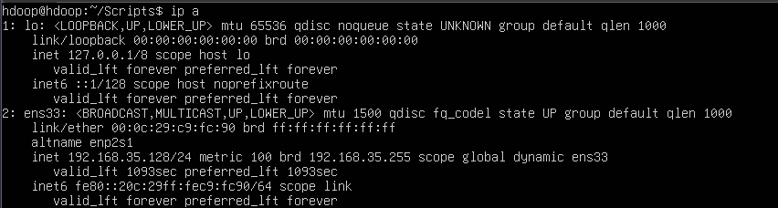
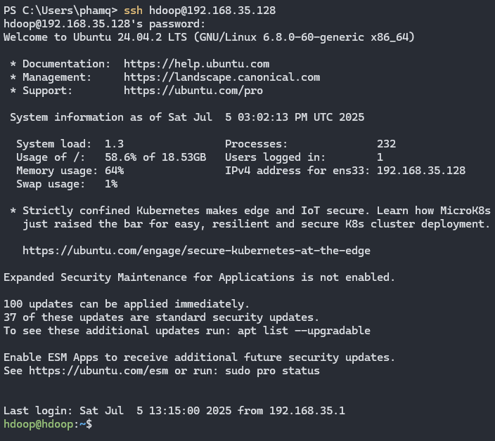

# Hướng dẫn sử dụng
1. Tải và giải nén <a href="[https://drive.google.com/file/d/15XK-jNDjznGzeXRSmXOt5ZBr8xpOd5PD/view?usp=drive_link](https://drive.google.com/file/d/1YwSKqACWQ_Jk-5ySAiSum99C2iXLdU4x/view?usp=sharing)"> file máy ảo sau</a>

2. Mở vmware và thêm máy ảo

3. Khởi động máy ảo. Username: ```hdoop```, password: ```hadoop```

4. Lấy ip máy ảo (sử dụng lệnh sau trong máy ảo)
```
ip a
```


sẽ có địa chỉ ip là: ```192.168.35.128```

5. Sử dụng terminal để tương tác với máy ảo:
``` bash
ssh hdoop@<địa chỉ ip máy ảo>
```

và nhập password vào



6. Nhập các lệnh sau
```
sudo ufw allow 50010:55000/tcp
sudo ufw allow 9000
sudo ufw allow 8080
sudo ufw allow 7077
sudo ufw allow 9870
sudo ufw allow 9864
```

7. Chạy lệnh
```
./Scripts/start-hdfs.sh
./Scripts/start-spark.sh
```

8. Tìm địa chỉ máy host

Windows
```
ipconfig.exe
```

Nếu dùng wifi thì tìm đến dòng ```Wireless LAN adapter Wi-Fi``` và copy địa chỉ ```IPv4 Address```

Linux
```
ip a
```

Làm tương tự bước ```4```

9. Thêm địa chỉ ip máy ảo vào máy host

Windows

9.1. Mở notepad với quyền admin

9.2. Mở file ```host``` trong đường dẫn ```C:\Windows\System32\drivers\etc```

9.3. Thêm dòng ```<địa chỉ ip máy ảo> hdoop```


10. Clone repository này về
```
git clone https://github.com/pnquang260805/Samsung.git
```

11. Cài đặt thư viện
```
pip install -r requirements.txt
```

12. Chạy file ```model.ipynb```
